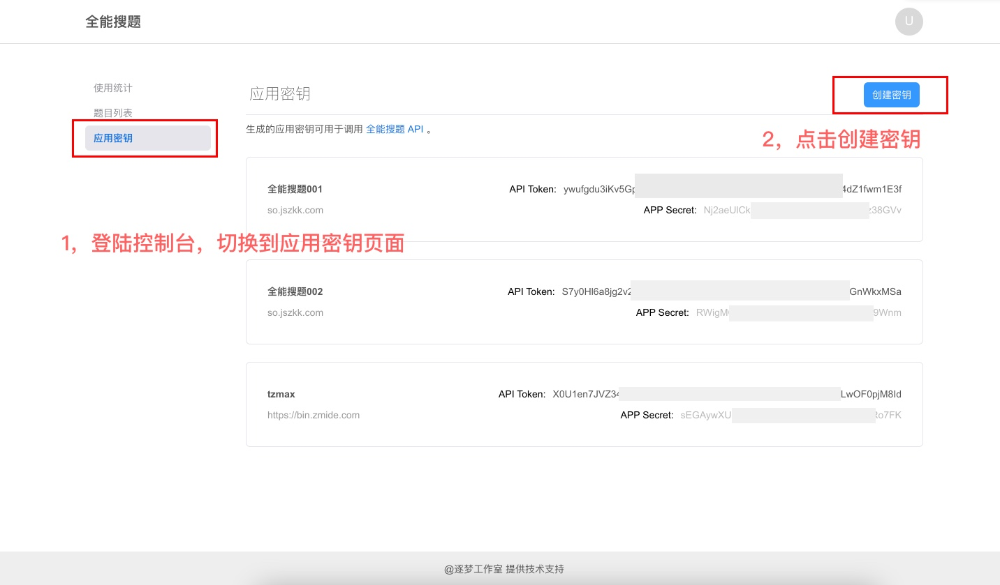
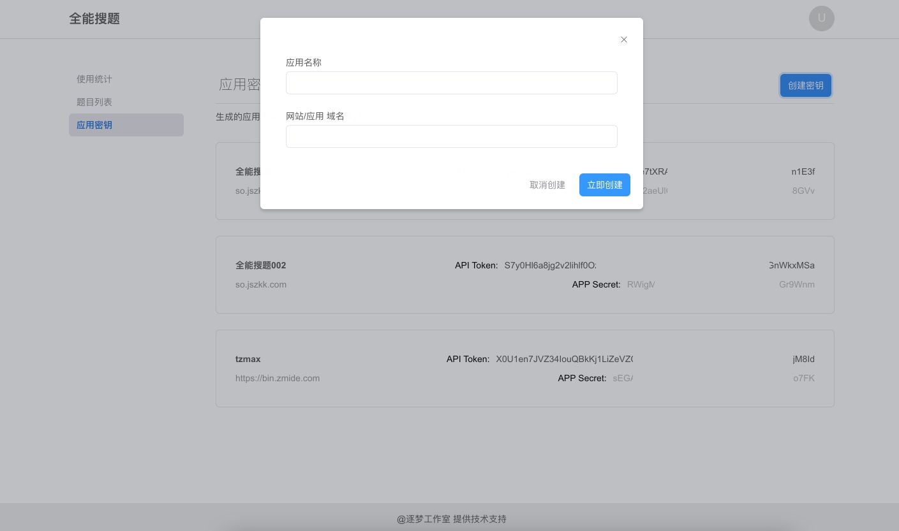
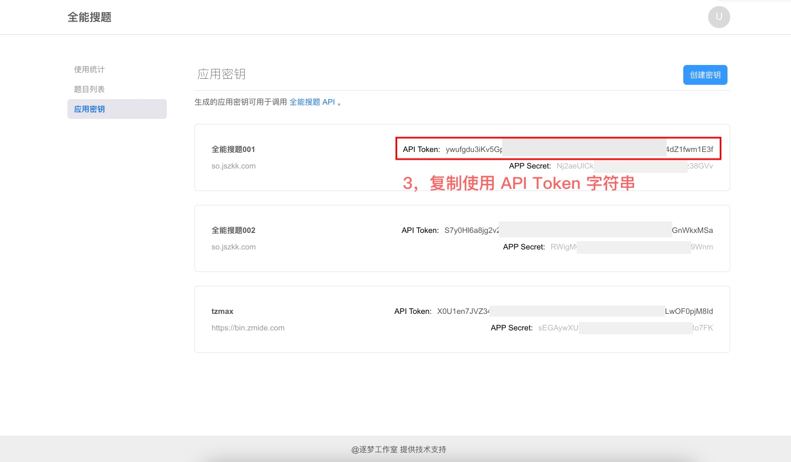

<!--
 * @Author: Bin
 * @Date: 2021-11-18
 * @FilePath: /docsso.jszkk.com/docs/README.md
-->

# 介绍

全能搜题项目是一个基于开源社区公开贡献的永久免费搜题系统。我们欢迎任何有能力的小伙伴提交 PR 或参与开发与维护包括提 Issue。

全能搜题项目是一个前后端分离项目，该文档是基于搜题后端提供的免费公开 API 进行文档化整理，希望帮助各位开发者能够更好的利用搜题系统。如果您不想使用公开的搜题 API 也可以在自己的服务器上私有部署全能搜题系统（但是我们不建议这样做，我们希望能够尽可能搭建一个全网公开的免费搜题系统，充分利用社区力量集中完善题库资源）

最后感谢您的支持，我们更新的动力离不开您的支持与鼓励。🎉

全能搜题官网：<https://so.jszkk.com>

全能搜题前端 GitHub 项目地址：<https://github.com/zmide/study.zmide.com>

全能搜题文档 GitHub 项目地址：<https://github.com/zmide/docs.study.zmide.com>

全能搜题 App 开源 GitHub 项目地址：<https://github.com/PBK-B/chaoxing-tool-client>

> 注: 全能搜题全部开源项目遵从 [MIT 许可协议开源](https://github.com/zmide/study.zmide.com/blob/main/LICENSE) ，任何人可以将其任意代码用于任何地方
>
> 免责声明: 受项目公开性质，作者与贡献者们不能保证数据来源是否合规，任何人都能提交搜索和使用系统的全部数据，在您使用该项目的任何服务时必须遵守相关国家法律法规并且本系统的全部文字在[知识共享 署名-相同方式共享 3.0 协议](https://creativecommons.org/licenses/by-sa/3.0/cn/deed.zh)之条款下提供，附加条款亦可能应用。（请参阅[使用条款](https://creativecommons.org/licenses/by-sa/3.0/cn/deed.zh)）

## 准备对接

> 在调用接口前你需要先注册登陆全能搜题开放平台 <https://so.jszkk.com> ，创建应用凭证（app secret）操作相关 API 都需要带上该凭证以便系统识别您的身份。

开放平台：<https://so.jszkk.com/>

服务端地址：`https://study.jszkk.com/`

### 文档目录

[[toc]]

### API 文档约定格式

全能搜题服务端 API 文档格式主要如下：

```
请求：
    基本信息
    请求头
    路径参数
    查询参数
    请求体
    请求体示例
响应：
    响应体
    响应体示例
    错误码
```

### 基本信息

介绍调用 API 所需要的请求方式、路径、访问凭证和权限等信息。

-   HTTP URL：服务端 API 的 URL。
-   HTTP Method：服务端 API 仅支持 HTTPS 协议和标准 HTTP 方法，如 GET、POST 等。
-   权限要求：调用 API 所需要权限，多个权限的关系为或，申请其中任一权限即可。
-   字段权限要求：请求返回结果中如需使用部分字段，需要特别申请权限。一般敏感字段的读取需要申请这类权限。

### 请求参数

调用 API 的详细入参说明，参数使用风格遵循 RESTFul，请注意不同参数在调用时的位置。

-   请求头：这部分参数需要放在 HTTP 请求的 Header 中，主要包含调用 API 所需要使用的访问凭证（API Token）以及 HTTP Content-Type。
-   路径参数：这部分参数需要放置在 URL 中，在文档中一般以`:`开头。
-   查询参数：这部分参数需要在 URL 后使用`?`进行连接，多个查询参数间以`&`分隔。
-   请求体：这部分参数需要放在 HTTP 请求的 Body 中，一般为 JSON 格式。
-   请求体示例：对应 API 的成功请求参数的样例。

### 响应

调用 API 的返回值。

-   响应体：一次 API 调用后，HTTP 响应中 Body 部分的内容。
-   响应体示例：API 成功请求结果的样例。
-   错误码：调用该 API 可能返回的错误码解释以及排查建议。

### API 调用流程

如下图所示，在调用服务端接口前，你需要完成以下准备工作：


-   1，登陆控制台，进入应用密钥页面，点击创建密钥
    

-   2，填写应用名称或网站名称，网站地址可以填写网站域名或者 APP 官网（没有的话可以填写 GitHub 个人主页或博客地址）不做限制
    

-   3，复制使用 API Token
    

### API 调用方式

调用服务端接口时，需要使用 HTTPS 协议、JSON 数据格式、UTF8 编码。请求需要把访问凭证 API Token 放到 Header 的 Authorization 中。

示例 ：

```
$ curl -X POST 'https://study.jszkk.com/api/open/add'
-H 'Authorization: <这里替换为对应的 API Token>'
-H 'content-type:application/json; charset=utf-8'
-d '{
	"content": "Hello World",
	"answer": "this is answer"
}'
```

### 题目选项数据格式

> 题目选项数据都由 JSON 数据格式组成
>
> 注意：在调用接口时可能需要将 json 字符串转义

#### 判断题

| 名称   | 类型    | 必填 | 描述                              |
| ------ | ------- | ---- | --------------------------------- |
| answer | boolean | 是   | 答案正确 `true`，答案错误 `false` |

数据示例

```
[
    {
        "answer": false
    }
]
```

#### 选择题（包括单选题和多选题）

| 名称     | 类型    | 必填 | 描述                                              |
| -------- | ------- | ---- | ------------------------------------------------- |
| name     | string  | 是   | 选项名称，26 字母一般以 `ABC … Z`                 |
| content  | string  | 是   | 选项内容                                          |
| isanswer | boolean | 是   | 是否为正确答案，答案正确 `true`，答案错误 `false` |

数据示例

```
[
    {
        "name": "A",
        "content": "CPU 与内存储器之间速度不匹配的问题",
        "isanswer": true
    }, {
        "name": "B",
        "content": "内存储器的问题",
        "isanswer": false
    }, {
        "name": "C",
        "content": "CPU 的问题",
        "isanswer": false
    }, {
        "name": "D",
        "content": "玩游戏的问题",
        "isanswer": false
    }
]
```

## API 列表

### 搜题接口

---

**请求**
| 基本 ||
| --- | --- |
| HTTP URL | https://study.jszkk.com/api/open/seek |
| HTTP Method | GET |

**请求头**
| 名称 | 类型 | 必填 | 描述 |
| --- | --- | --- | --- |
| Content-Type | string | 是 | **固定值：**"application/json; charset=utf-8" |

**查询参数**
| 名称 | 类型 | 必填 | 描述 |
| --- | ---| --- | --- |
| q | string | 是 | 需要搜索的题目内容或题目关键词<br>**示例值：**"计算机的特点是（ ）。" |

**请求体**

> 该请求无请求体

**请求体示例**

```
curl --location --request GET 'https://study.jszkk.com/api/open/seek?q=计算机的特点是（ ）。'
```

**响应体**
| 名称 | 类型 | 描述 |
| --- | --- | --- |
| code | int | 响应码，200 表示成功 |
| msg | string | 错误描述 |
| data | data | - |
| ∟ question | string | 题目内容 |
| ∟ answer | string | 正确答案<br>多选题结果用 `#` 符号分割 |

**响应体示例**

```
{
    "code": 200,
    "msg": "",
    "data": {
        "question": "计算机的特点是（ ）。",
        "answer": "具有记忆和逻辑判断能力 # 能自动运行、支持人机交互 # 有高速运算的能力  "
    }
}
```

### 提交单个题目

---

**请求**
| 基本 ||
| --- | --- |
| HTTP URL | https://study.jszkk.com/api/open/add |
| HTTP Method | POST |

**请求头**
| 名称 | 类型 | 必填 | 描述 |
| --- | --- | --- | --- |
| Content-Type | string | 是 | **固定值：**"application/json; charset=utf-8" |
| Authorization | string | 是 | API Token，参考文档 [API 调用流程](#api-调用流程) 创建 API Token<br> **示例值：**"xMjcuMC4wLjE6ODAwMFwvYXBpXC9hdXRoX…" |

**查询参数**

> 该请求无查询参数

**请求体**
| 名称 | 类型 | 必填 | 描述 |
| --- | ---| --- | --- |
| type | int | 否 | 题目类型（-1 无类型【默认】，0 单选题，1 多选题，3 判断题） |
| content | string | 是 | 题目内容<br>**示例值：**"在 CPU 中配置高速缓冲器（Cache）是为了解决（ ）。" |
| answer | string | 否 | 题目答案，题目答案和题目选项必须提交其中一个<br>**示例值：**"CPU 与内存储器之间速度不匹配的问题" |
| options | string \| array | 否 | 题目选项，题目答案和题目选项必须提交其中一个，JSON 数据格式请参考 [题目选项数据格式](#题目选项数据格式) <br>**示例值( JSON 转义字符串类型 )：**`[{\"name\":\"A\",\"content\":\"CPU与内存储器之间速度不匹配的问题\",\"isanswer\":true},{\"name\":\"B\",\"content\":\"内存储器的问题\",\"isanswer\":false},{\"name\":\"C\",\"content\":\"CPU的问题\",\"isanswer\":false},{\"name\":\"D\",\"content\":\"玩游戏的问题\",\"isanswer\":false}]` <br>**示例值( 数组类型 )：**`[{"name":"A","content":"CPU 与内存储器之间速度不匹配的问题","isanswer":true},{"name":"B","content":"内存储器的问题","isanswer":false},{"name":"C","content":"CPU 的问题","isanswer":false},{"name":"D","content":"玩游戏的问题","isanswer":false}]`|

**请求体示例**

> 只有答案的题目

```
curl --location --request GET 'https://study.jszkk.com/api/open/add' \
--header 'Authorization: XXXXXXXXX' \
--header 'Content-Type: application/json' \
--data-raw '{
    "content": "在CPU中配置高速缓冲器（Cache）是为了解决（ ）。",
    "answer": "CPU与内存储器之间速度不匹配的问题"
}'
```

> 带答案选项的题目，题目选项 JSON 数据格式请参考 [题目选项数据格式](#题目选项数据格式)

```
curl --location --request GET 'https://study.jszkk.com/api/open/add' \
--header 'Authorization: XXXXXXXXX' \
--header 'Content-Type: application/json' \
--data-raw '{
    "content": "在CPU中配置高速缓冲器（Cache）是为了解决（ ）。",
    "options": "[{\"name\":\"A\",\"content\":\"CPU与内存储器之间速度不匹配的问题\",\"isanswer\":true},{\"name\":\"B\",\"content\":\"内存储器的问题\",\"isanswer\":false},{\"name\":\"C\",\"content\":\"CPU的问题\",\"isanswer\":false},{\"name\":\"D\",\"content\":\"玩游戏的问题\",\"isanswer\":false}]"
}'
```

**响应体**
| 名称 | 类型 | 描述 |
| --- | --- | --- |
| code | int | 响应码，200 表示成功 |
| msg | string | 错误描述 |
| data | data | - |
| ∟ type | int | 题目类型（-1 无类型，0 单选题，1 多选题，3 判断题） |
| ∟ content | string | 题目内容 |
| ∟ answer | string | 题目答案 |

**响应体示例**

```
{
    "code": 200,
    "msg": "",
    "data": {
        "type": -1,
        "content": "在CPU中配置高速缓冲器（Cache）是为了解决（ ）。",
        "answer": "CPU与内存储器之间速度不匹配的问题",
        "updated_at": "2021-11-18T04:05:21.000000Z",
        "created_at": "2021-11-18T04:05:21.000000Z"
    }
}
```

## 私有化部署

> 服务端代码正在整理，准备开源…

## 支持我们

> 您可以通过以下方式对我们进行支持：
>
> -   **在项目中添加使用标识**
> -   **提交 PR**
> -   **提出 ISSUE**
> -   **加入我们**
> -   **提供服务器或者其他资源**
> -   **通过捐赠**
>
> 我们承诺，所有捐赠将用于项目的服务器或其他资源购买支出，项目正常维护支出。


## 鸣谢

> **感谢所有支持我们的小伙伴，以及来自 [@Bilibili](https://www.bilibili.com/video/BV1Jq4y1u7Wm) 给观看点赞投币关注的各位 _产品经理_ 们**
>
> 下面列举项目用到的部分主要开源项目，排名不分先后，还有很多没有在列表的项目这里对所有的开源项目的作者以及维护者表示由衷感谢，谢谢你们的辛劳和无私奉献。
>
> 更多依赖项请查看项目 [github.com/zmide/study.zmide.com/package.json](https://github.com/zmide/study.zmide.com/blob/main/package.json)

-   [Laravel](https://github.com/laravel/laravel) - A PHP framework for web artisans. Quote MIT licensed.

-   [reactjs](https://reactjs.org/) - A declarative, efficient, and flexible JavaScript library for building user interfaces. Quote MIT licensed.

-   [typescript](https://github.com/Microsoft/TypeScript) - TypeScript is a language for application-scale JavaScript. Quote Apache-2.0 licensed.

-   [rsuite](https://github.com/rsuite/rsuite) - React Suite is a set of react component libraries for enterprise system products. It is a well-thought-out and developer-friendly UI framework. Quote MIT licensed.

-   [axios-hooks](https://github.com/simoneb/axios-hooks) - Promise based HTTP client for the browser and node.js,Quote MIT licensed.

-   [mobx and mobx-react](https://github.com/mobxjs/mobx) - Simple, scalable state management. React bindings for MobX. Create fully reactive components. Quote MIT licensed.

-   [sass](https://github.com/sass/dart-sass) - A pure JavaScript implementation of Sass. Sass makes CSS fun again. Quote MIT licensed.

-   [vuepress](https://github.com/vuejs/vuepress) - 📝 Minimalistic Vue-powered static site generator. Quote MIT licensed.

## 开源协议

@[code](../LICENSE)
